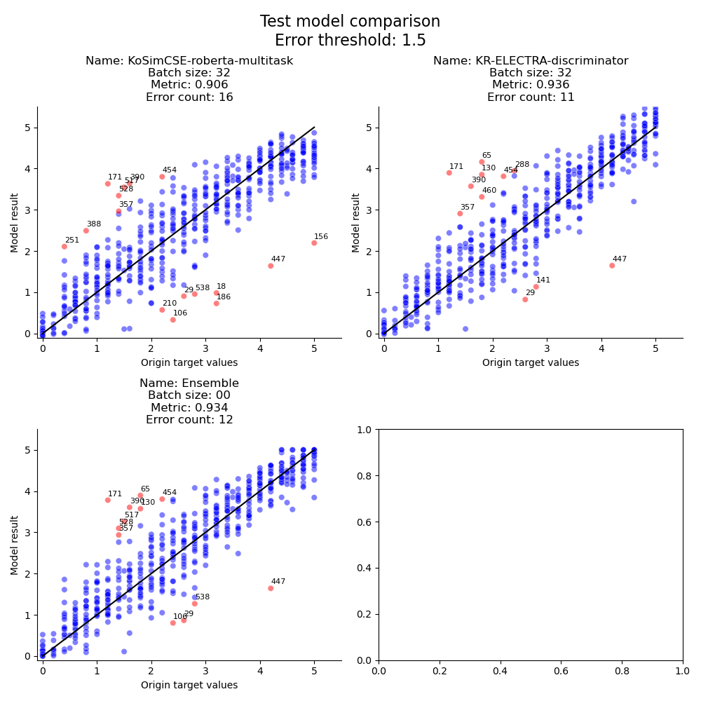
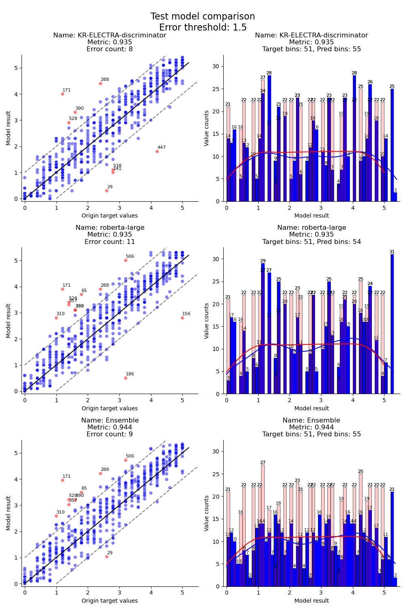
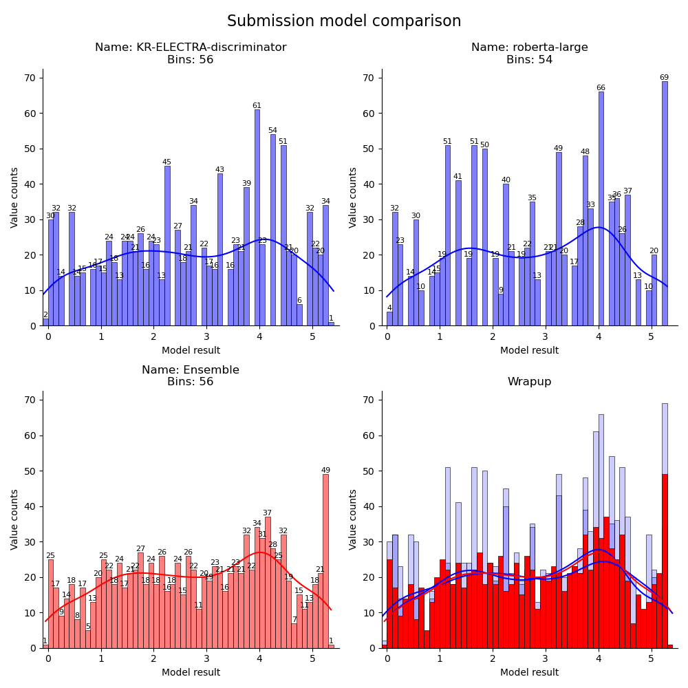

## Demo Grid Search Model

밤새 모델을 돌려놓을 목적으로 baseline 을 refactoring 한 코드 입니다.

### Configuration

`config` 폴더 내부에 `config.json` 파일에서 hyper-parameter 를 수정해주세요.

```json
{
    "seed": 1784,
    "inference": false,
    "best": false,
    "test": false,
    "wandb_project_name": "<your-wandb-project-name>",
    "wandb_username": "<your-wandb-user-name>",
    "model_name": ["klue/roberta-base", "klue/roberta-small"],
    "model_detail": ["v", "v"],
    "resume": false,
    "batch_size": [16, 32, 64],
    "max_epoch": [5, 10, 15],
    "shuffle": true,
    "learning_rate": [1e-5, 5e-5],
    "kfold": 5,
    "data_dir": "./data",
    "test_output_dir": "./test_outputs",
    "output_dir": "./outputs",
    "model_dir": "./saves",
    "train_path": "train.csv",
    "dev_path": "dev.csv",
    "test_path": "dev.csv",
    "predict_path": "test.csv"
}
```
- `data` 폴더 내부에 `train.csv`, `dev.csv`, `test.csv`, `sample_submission.csv` 를 넣어놔주세요.
- `model_name` 의 list 에 원하는 모델을 추가가능합니다.
- `model_detail` 의 경우 `model_name` 와 같은 인덱스에 대응해야 합니다.
- `batch_size`, `max_epoch`, `learning_rate` 에 명시된 각 원소들을 조합하여 모든 combination 에 대해 모델을 실행합니다.
- `kfold` 값을 1보다 크게 설정한 경우 cross-validation 으로 학습합니다.
  - 이때 각 fold 당 학습횟수는 `max_epoch // kfold` 입니다.


### Manual

#### Training

> `python run.py`

모델 저장은 `./saves/` 내부에 저장됩니다.
- 저장 path 는 `./saves/klue/roberta-small_v03_16_1_1e-05_000_00583_0.862_20231214_221830.ckpt`형식 이며
- 이름 `roberta-small_v03_16_1_1e-05_000_00583_0.862_20231214_221830` 은
  - `roberta-small`: 모델명
  - `v03`: 버전
    - 버전은 매 combination 마다 자동으로 update 됩니다.
  - `16`: batch_size
  - `1`: max_epoch
  - `1e-05`: learning_rate
  - `000`: current_epoch
  - `00583`: current_step
  - `0.862`: pearson value
  - `20231214_221830`: current_date _ current_time

#### Inference

> `python run.py --infence {--best} {--test}`

- `--best` 옵션 설정하신 경우 가장 성능이 좋았던 모델을 기준으로 inference
- 하지 않을경우, 가장 최근의 모델을 기준으로 inference 합니다.
- `--test` 옵션을 설정할 경우 `test_path` 에 있는 dataset 을 기준으로 예측값을 측정하여 하나의 csv 파일로 concat 합니다.
  - 출력의 경우 `test_output_dir` 내부에 모델 author (snunlp, klue, etc.) 별로 폴더를 만들어 저장합니다.
  - 파일명은 위의 모델 이름에서 person value 값을 예측값으로 부터 새로 계산하고, 현재 시간을 반영한 상태로 저장됩니다.


결과는 `./outputs/` 에 저장됩니다.
- `data` 폴더 내부의 `sample_submission.py` 에서 input 을 읽어오며,
- 형태는 `{위의 모델 체크포인트 이름}.csv` 의 형태로 저장됩니다.

#### Ensemble

> `python --inference --ensemble {--test}`

앙상블을 하기위해서는 미리 `./ensembles` 디렉토리를 준비해주셔야합니다.
- 디렉토리를 만드신후 앙상블 하고 싶으신 모델 체크포인트를 직접 모델제작자 (snunlp, klue etc.) 폴더 내에 복사해 주세요.

폴더 구조
- ensembles
  - 모델제작자
    - 모델이름.ckpt
  - snunlp
    - KR-ELECTRA-discriminator-... .ckpt
  - klue
    - roberta-large-... .ckpt


방식
- `--test` 일 경우, test dataset 을 불러와서 `ensembles` 내에 저장된 각각의 모델을 불러와서 예측값을 계산합니다.
  - 모델별 예측결과를 concat후 softmax 를 거쳐 가중합을 계산합니다.
  - test dataset 에 GT 와 각 모델 별 + 앙상블 결과를 각각 비교하여 evaluation metric 값을 계산하고, 산점도를 출력합니다.
    - 산점도는 `./plots` 폴더가 자동 생성되며 내부에 `plot_models_{생성일자}_{생성시간}.png` 형태로 저장됩니다.
- 예시 plot
  

  - 계산된 결과는 `./test_output` 에 `ensemble` 폴더 내부에 저장 됩니다. (기존의 모델 저자 폴더 e.g. `snunlp`, `klue` etc.)

- `--test` 를 하지 않으실경우 기존 inference 와 동일하게 prediction data 를 읽어와서 각 row 에맞는 예측값을 계산하여, concat 한 후, `./output` 의 `ensemble` 폴더 내부에  `csv` 형태로 저장합니다.

#### Ensemble from csv

이미 inference 가 완료된 csv 파일을 이용하여 ensemble 을 수행하고 결과를 새로운 csv 파일로 저장합니다.

`csvplot` 폴더내부의 `plots.py` 에 함수가 정의되어 있으며, `plotcsv.ipynb` 노트북 파일에서 import 해서 사용하시면 편리합니다.

> def ensemble_from_test_csv(target_path, target_column, pred_dir, pred_column, plot_dir="./plots", result_dir="./results", error_gap: float = 0.5)

- 비교할 label이 존재한 test dataset 을 대상으로 inference 한 결과 (`python run.py --inference --test`) csv 파일들을 모아서, 앙상블을 계산합니다.
- 각 결과에 대해 (각 모델 및 앙상블 포함) error plot (산점도) 과 label 분포 plot (히스토그램) 을 그린후 `plot_dir` 폴더 내부에 `ensemble_from_test_csv_{생성일자}_{생성시간}.png` 의 이름으로 저장합니다.
- 앙상블 결과를 기존 target csv 에 합쳐서 `result_dir` 폴더 내부에 `ensemble_from_test_csv_{생성일자}_{생성시간}.csv` 로 저장합니다.
- Args:
  - `target_path`: target label 이 존재하는 기준 csv 파일. 여기서는 dev.csv
  - `target_column`: target csv 에서 label 을 나타내는 열 이름
  - `pred_dir`: 기존에 dev.csv 를 활용하여 inference 한 결과 csv 들을 모아둔 폴더
  - `pred_column`: inference 한 결과에서 prediction 을 나타내는 열 이름
  - `plot_dir`: 완성된 plot 을 저장하는 폴더
  - `result_dir`: 앙상블된 결과 csv 를 저장하는 폴더
  - `error_gap`: error plot 에서 error 로 평가하는 기준 (target value 와 prediction value 간의 차이 절댓값)
- 예시 plot
  

  - 각 csv 파일 하나당 row 하나를 차지합니다.
  - 마지막 row 에는 ensemble 된 결과에 대한 plot 을 보여줍니다.
  - 모든 bin 의 간격은 0.1 로 동일합니다.
  - 히스토그램간 y 축의 범위를 공유합니다.

> def ensemble_from_submission_csv(pred_dir, target_path="../data/sample_submission.csv", plot_dir="./plots", result_dir="./results"):

- sample_submission.csv 를 대상으로 inference 한 결과 (`python run.py --inference`) csv 파일을 보아서 앙상블을 계산합니다.
- 제출 파일에는 비교할 GT가 없으므로, 각 결과에 대해 (각 모델 및 앙상블 포함) label 분포 plot (히스토그램) 을 그린후 `plot_dir` 폴더 내부에 `ensemble_from_submission_csv_{생성일자}_{생성시간}.png` 의 이름으로 저장합니다.
- sample_submission.csv 의 `target` 열의 값을 앙상블 결과로 대체한 후, `result_dir` 폴더 내부에 `ensemble_from_submission_csv_{생성일자}_{생성시간}.csv` 로 저장합니다.
- Args:
  - `pred_dir`: inference 가 끝난 csv 파일을 모다둔 폴더
  - `target_path`: sample_submission.csv 의 path
  - `plot_dir`: 완성된 plot 을 저장하는 폴더
  - `result_dir`: 앙상블된 결과 csv 를 저장하는 폴더
- 예시 plot
  
  - 앙상블 결과는 Ensemble subplot 에 빨간색으로 표시됩니다.
  - 가장 마지막 subplot 에는 모든 결과를 통합하여 보여주며, 마찬가지로 앙상블 결과만 빨간색으로 표시됩니다.


### Update

#### 2023-12-16

- 일부 boolean argument 에 대한 적용방법이 변경되었습니다. 기존 `--inference=true` 에서 `--inference` 로 바뀌었습니다.

- `--best` args 를 추가하여 최고성능 체크포인트를 기준으로 inference 할수 있도록 하였습니다.

- `KFoldDataloader` 에도 additional token 이 추가되었습니다.

- 추가 토큰에 대해, 이제는 `Model` 내부에서 직접 vocab 크기를 바꿔줘야 합니다.

#### 2023-12-19

- Ensemble 기능 업데이트 되었습니다.

- `python run.py --inference --ensemble {--test}`

- Ensemble 할때 error 에 대한 자동 plotting 기능도 추가되었습니다.

#### 2023-12-21

- Ensemble from csv 기능 업데이트 되었습니다.

  - 이제 모델을 거치지 않고 결과파일 만을 사용하여 앙상블 및 분포비교가 가능합니다.

  -  `run.py` 와 독립적으로 작동하며, `csvplots` 폴더내부의 형태를 그대로 따라가시면 됩니다.

- Regularization 기법들이 적용된 `RDropRegressionModel` 이 `./models/model.py` 에 추가되었습니다.

  - 이제 final hidden state 에서 CLS 토큰 뿐만 아니라, 그 뒤에 붙은 special token 도 모델에 활용합니다.

  - regression head 에 dropout 을 사용합니다 $\rightarrow$ Rdrop panelty 를 loss 에 반영하였습니다.

  - lr scheduling 으로 warm up 과 함께 (ward up 이후) StepLR 을 사용하도록 변경하였습니다.

